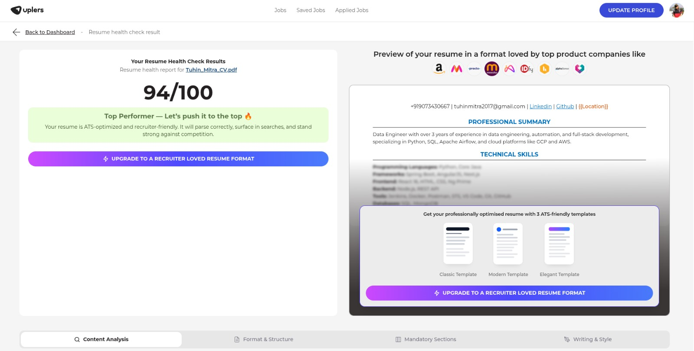
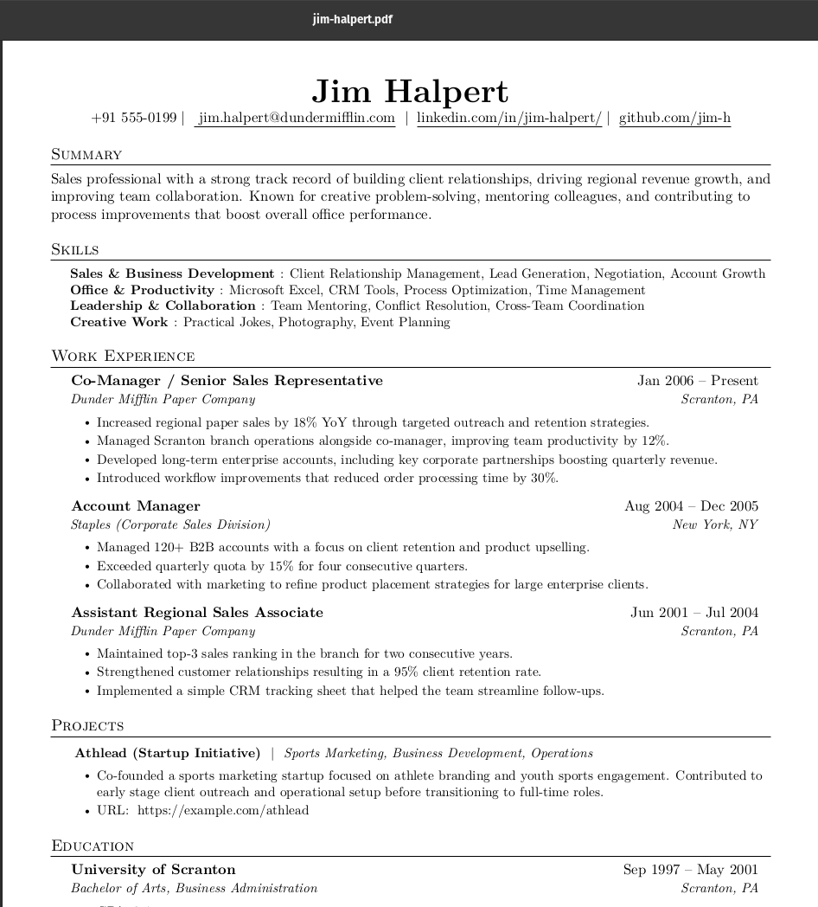

## jinja2-latex-resume

Good luck getting 94+ ATS score resumes in minutes! 🚀



> This project generates professional, highly customizable resumes with Python, Jinja2 templating, LaTeX, and automatic PDF export. Effortlessly create data-driven, beautiful CVs with modern, automated workflows.

**In simple terms:**

➡️ You upload a json (relatively easy structure to latex) with your professional details \
➡️ This project uses the existing template .tex (latex file converted to jinja2 template) \
➡️ Renders a .tex file with your details \
➡️ Compiles to a beautiful PDF resume.

**What problem does it solve?**

➡️ Creating a professional resume from scratch in LaTeX can be time-consuming, you copy paste sections that you want to use for your new resume in no time.

➡️ It's free of cost, open-source, and highly customizable. You can tweak the LaTeX template to your liking. (I will add more templates soon too 😎)

➡️ You can create an automated workflow to generate resumes for multiple roles/job descriptions by just changing the input json. (With the help of LLMs, you can even generate the json automatically from your existing resume!) - LLMs often restructure PDFs poorly, so json is a better (and cheaper) format to work with.


### Example Usage:

Given that you already have a resume json file named [`resume-jim-halpert.json`](./examples/input_resume_json/resume-jim-halpert.json), you can generate a PDF resume by running the following command:

```bash
python render_resume.py --resume-json resume-jim-halpert.json --output-pdf jim-halpert.pdf
```

Or, using `uv`:

```bash
uv run render_resume.py --resume-json resume-jim-halpert.json --output-pdf jim-halpert.pdf
```

Check out the generated PDF resume: [jim-halpert.pdf](examples/output_resume_pdf/jim-halpert.pdf)

More examples of input JSON, and output PDF here: [examples/](./examples/)

#### 🎉 Resume Preview 🎉

[](examples/images/jim-halpert-resume-preview.png)

### Coming up soon:

- more templates 🥳
- better documentation 
- tested report for windows devices (currently only tested on linux - windows setup code is LLM generated but untested)

### Usage Guide & Generating Resume JSON for the first time

- I generally go to this site: [docstrange.nanonets.com](https://docstrange.nanonets.com/?output_type=flat-json) -> Upload existing resume PDF -> Export as flat JSON file and download it.

- Then I use this prompt: [here](./examples/ChatGPT_prompt_generating_resume-json.md) to convert the flat JSON/plain text/markdown to the required resume JSON format.

- Finally I tweak the generated JSON to add/remove sections as per my requirement.

- Run the `render_resume.py` script to generate the PDF resume.

> ⚠️ Still working on it. ⚠️